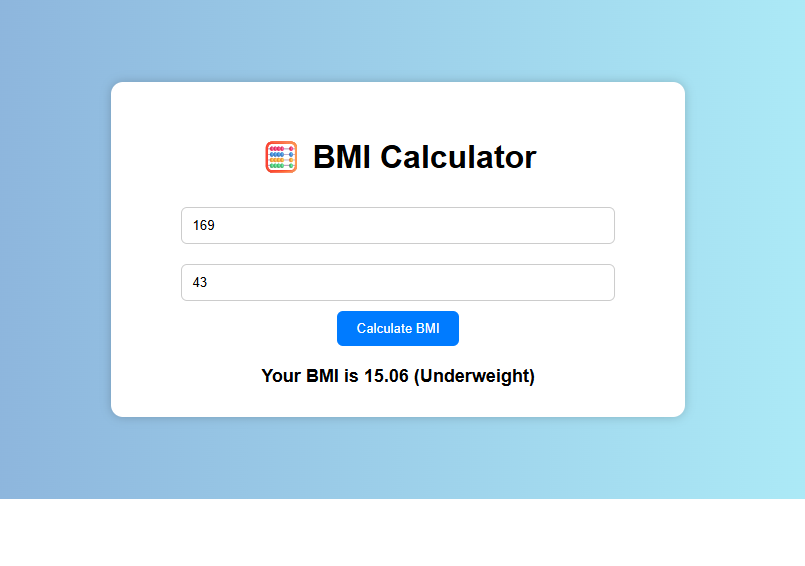

# 🧮 BMI Calculator

A clean and responsive web app that calculates **Body Mass Index (BMI)** based on height and weight. Works 100% offline — no API required!

---

## 🚀 Features

- Calculates BMI using metric units (cm, kg)
- Gives BMI category: Underweight, Normal, Overweight, Obese
- Clean responsive layout
- No API or internet needed — pure HTML, CSS, JS
- Beginner-friendly project for practicing JavaScript DOM

---

## 📸 Preview

 <

---

## 🛠 Tech Stack

- ✅ HTML5 – Page layout
- ✅ CSS3 – Styling and layout
- ✅ JavaScript – BMI calculation logic

---

## 📁 Project Structure

bmi-calculator/
├── index.html # UI layout
├── style.css # Styling
├── script.js # BMI calculation logic
├── README.md # Project details
└── bmi-preview.png # Optional preview image

---

## 📌 How It Works

1. User enters height in **cm** and weight in **kg**
2. App converts height to meters and applies formula:  
   `BMI = weight / (height * height)`
3. Shows BMI value and category:
   - `< 18.5`: Underweight
   - `18.5 - 24.9`: Normal weight
   - `25 - 29.9`: Overweight
   - `30+`: Obese

---

## ✅ Use Cases

- Great beginner-level project
- Practice JS DOM manipulation
- Perfect for GitHub portfolios and commits
- No internet = demo anytime

---

## 💡 Bonus Features (Try Adding)

- Input validation with color indicators
- Save last BMI result to localStorage
- Dark/light mode switch
- Voice feedback using Web Speech API

---

## 🧑‍💻 Author

Made with ❤️ by [**Santhiya Baskar**](https://www.linkedin.com/in/santhiya-baskar-675a85258)

---

## 📃 License

This project is free to use under the **MIT License**.
